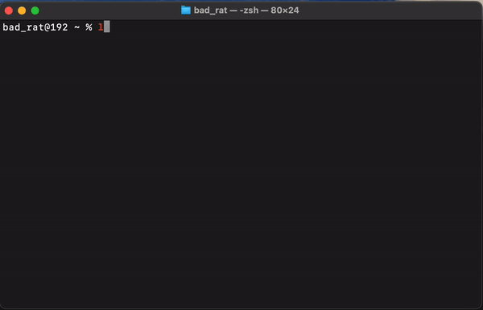
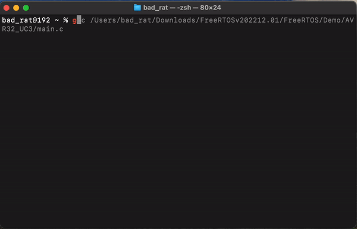
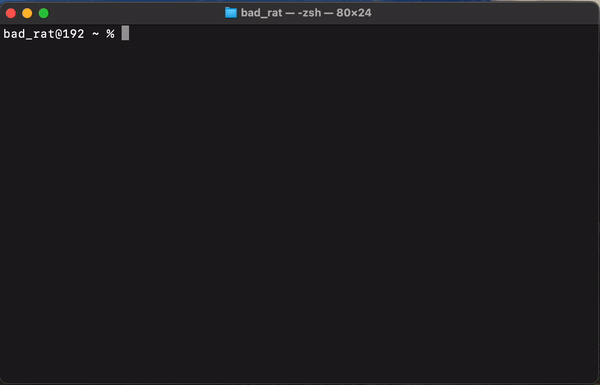
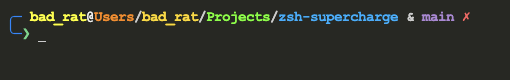
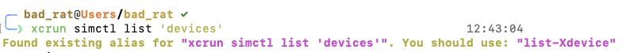

# zsh-supercharge

## Overview

**zsh-supercharge** is a script designed to enhance the Zsh shell experience on macOS by installing and configuring a suite of powerful plugins. These plugins provide additional completion definitions, syntax highlighting, command history suggestions, interactive directory navigation, and reminders to use Zsh features.

## Features

- **Homebrew Installation**: Checks for Homebrew and installs it if not present.
- **Git Installation**: Checks for Git and installs it if not present.
- **fzf Installation**: Installs `fzf` for command-line fuzzy finding if not already installed.
- **Zsh Plugin Installation**: Clones and sets up the following Zsh plugins:
  - zsh-completions: Additional completion definitions.
  - zsh-syntax-highlighting: Highlights commands as you type.
  - zsh-autosuggestions: Suggests commands based on history.
  - zsh-history-substring-search: Search command history with substring match.
  - zsh-interactive-cd: Enhanced 'cd' command with interactive features.
  - zsh-you-should-use: Reminds you to use Zsh plugins and built-in features.
  - zsh-modern-theme: A modern Zsh theme with color support and prompt customization.

## Installation

1. Clone the repository:

```sh
git clone https://github.com/BadRat-in/zsh-supercharge.git
```

2. Navigate to the project directory:

```sh
cd zsh-supercharge
```

3. Make the setup script executable:

```sh
chmod +x setup.sh
```

4. Run the setup script:

```sh
source ./setup.zsh
```

## Plugin Descriptions

- **zsh-completions**: Adds thousands of additional completion definitions for various commands, improving the efficiency and convenience of command completion in Zsh.

- **zsh-syntax-highlighting**: Highlights commands as you type them in the terminal, helping you spot syntax errors and understand command structure better.

- **zsh-autosuggestions**: Suggests commands based on your command history as you type, speeding up your workflow and reducing the need to retype commonly used commands.

- **zsh-history-substring-search**: Allows you to search through your command history using substring matching, making it easier to find and reuse previous commands.

- **zsh-interactive-cd**: Enhances the 'cd' command with interactive features, making directory navigation faster and more intuitive.

- **zsh-you-should-use**: Reminds you to use Zsh plugins and built-in features, encouraging you to take full advantage of Zsh's capabilities.

- **zsh-modern-theme**: A modern Zsh theme with color support and prompt customization, making the terminal more visually appealing and user-friendly.

## Configuration

The script appends the necessary configuration to your `.zshrc` file to enable the plugins. Here's the configuration added by the script:

```sh
# Configuring Zsh plugins to supercharge the macOS Terminal app

# Add zsh-completions to the fpath
fpath=($HOME/.zsh/zsh-completions/src $fpath)

# Initialize completion system
autoload -Uz compinit && compinit

# Enable zsh-syntax-highlighting for command syntax highlighting
source $HOME/.zsh/zsh-syntax-highlighting/zsh-syntax-highlighting.zsh

# Enable zsh-autosuggestions for command history suggestions
source $HOME/.zsh/zsh-autosuggestions/zsh-autosuggestions.zsh

# Enable zsh-history-substring-search for searching command history
source $HOME/.zsh/zsh-history-substring-search/zsh-history-substring-search.zsh

# Enable zsh-interactive-cd for an enhanced 'cd' command experience
source $HOME/.zsh/zsh-interactive-cd/zsh-interactive-cd.plugin.zsh

# Enable zsh-you-should-use to remind you to use Zsh features and plugins
source $HOME/.zsh/zsh-you-should-use/you-should-use.plugin.zsh

# Enable zsh-modern-theme for a modern Zsh theme with Git status and command duration
source $HOME/.zsh/zsh-modern-theme/modern-theme.zsh
```

## Usage

You can now enjoy the enhanced features and productivity benefits provided by the plugins.

### Syntax Highlighting



### Command History Suggestions



### Interactive CD



### Zsh Modern Theme



### Zsh You Should Use



## License

This project is licensed under the Mozilla Public License 2.0. See the [LICENSE](LICENSE) file for details.
